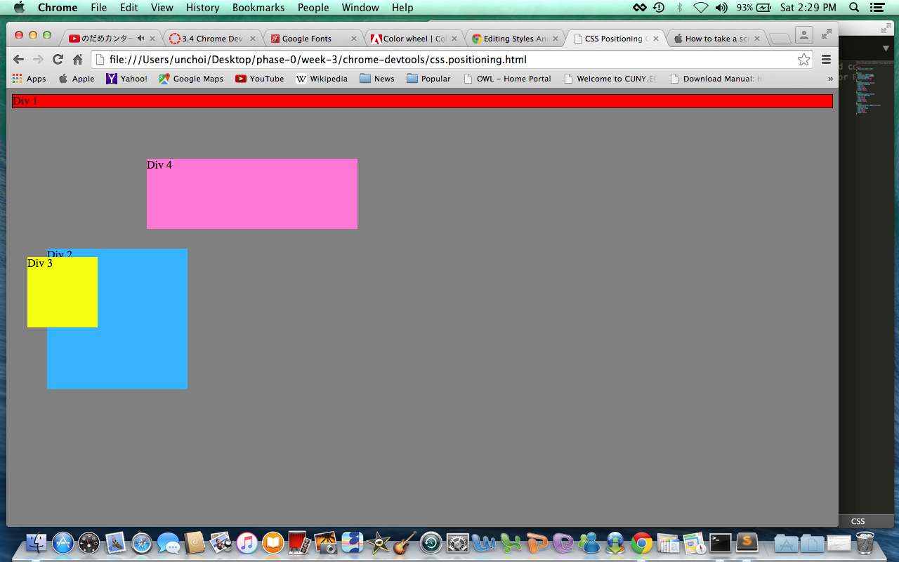
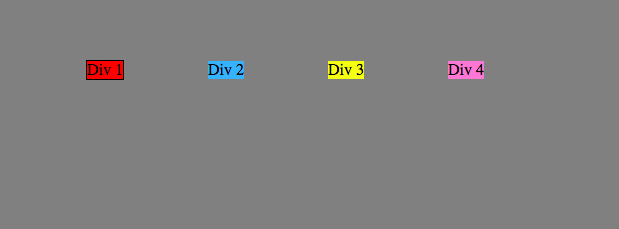
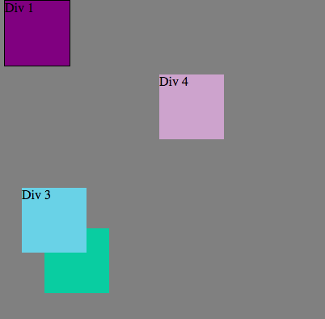
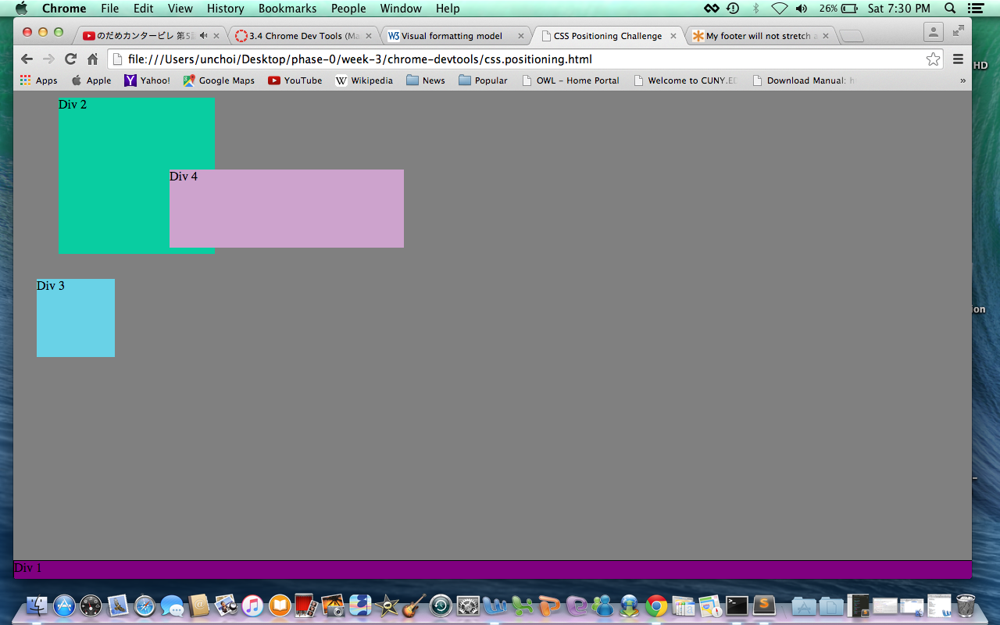
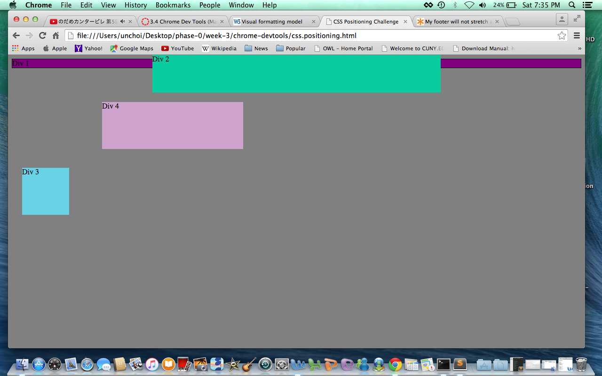
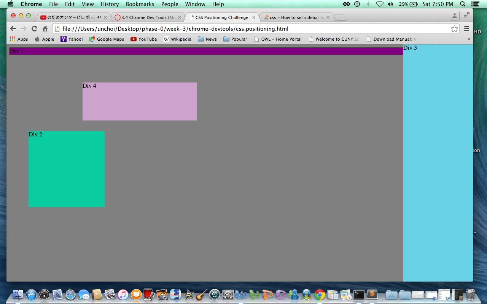
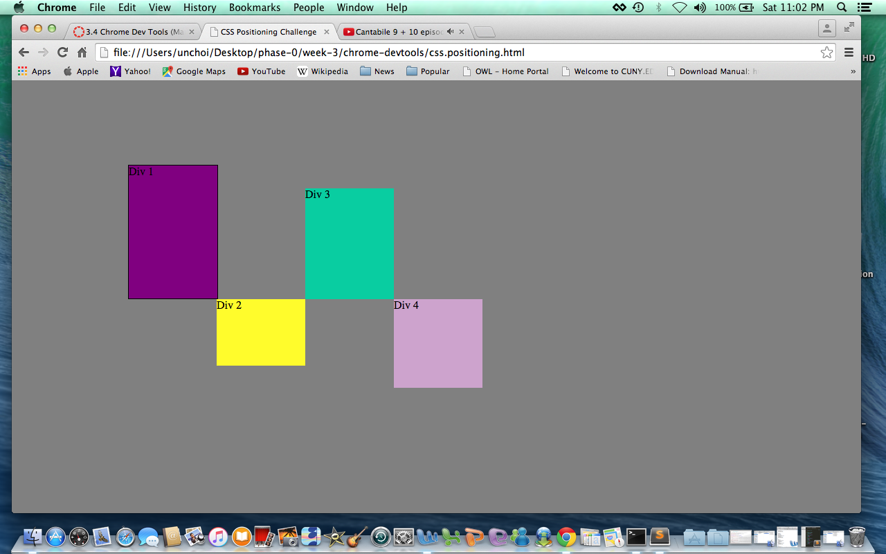

**Chrome Dev Tools**

Exercise 1 Change the Colors 

Exercise 2 Column 

Exercise 3 Row 

Exercise 4 Make Equidistant 

Exercise 5 Squares 

Exercise 6 Footer 

Exercise 7 Header 

Exercise 8 Sidebar 

Exercise 9 Get Creative 

**How can you use Chrome's DevTools inspector to help you format or position elements?**
The Chrome DevTools organizes the html files based on DOM into sections and allows a platform on which a user can apply css styles and settings on a specific section and see the effects it'l have on the web page, all on the same screen. This is a good way to experiment or try out css codes.

**How can you resize elements on the DOM using CSS?**
One can resize elements by specifying or identifying the object, for example by assigning it a class as an identifier, and then use CSS to format the size by indicating margin, height, position, and so on.

**What are the differences between Absolute, Fixed, Static, and Relative positioning? Which did you find easiest to use? Which was most difficult?**
Absolute position indicates that the position of the object is set in one position, regardless of the flow of the other elements on the page. So, even if the other elements move, the one with the absolute position will keep its position. A fixed position is similar to absolute postion in that the position of the object does not change. However, one difference is that the position is maintained within the flow of the other elements. So, when the other elements move, the object maintains its position in respect to the elements. Relative position is effected by the flow of the other elements, so its position changes i relation to the changes of the other elements. Static position is the default position and appears at the position where it is normally expected.

**What are the differences between Margin, Border, and Padding?**
Margin determines the amount of space around an element. For exmple, the margin of a table indicates the space between the table and another element or the edge of the web page. Border is the boundary of the element, so a table has a border for the table itself and borders for rows, columns, and cells. Padding is the space around the element and the border. For example, if a text in a cell of a table is centered, it has padding between the center to the border of the cell.

**What was your impression of this challenge overall? (love, hate, and why?)**
I found this challenge to be trying and often tedious, although it was a good way to practice getting to know some of the css features. I suppose as with many things, it'll require a lot of time spent on practice and experimentation with css to be able to manipulate and move things around freely. 
